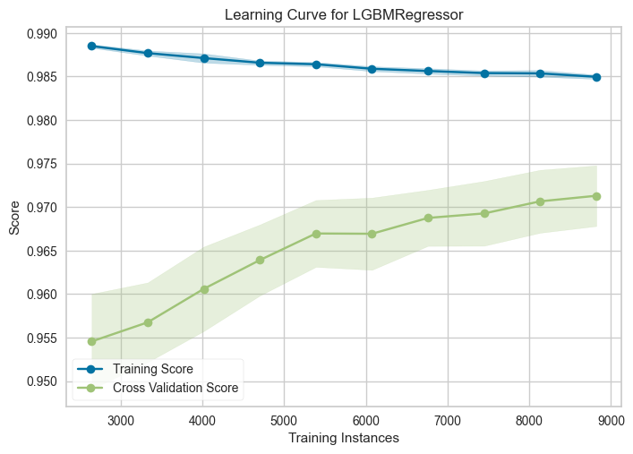
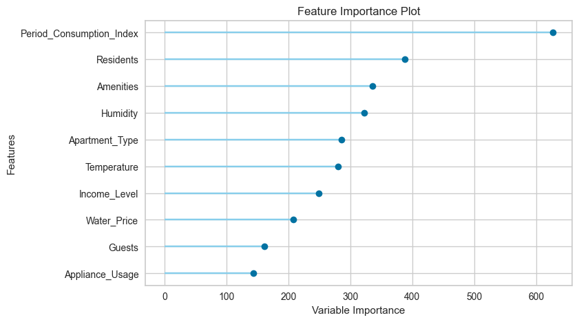
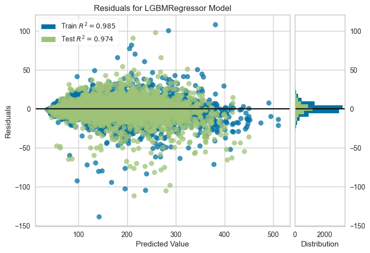

# Smart Water Monitoring System — Consumption Prediction

A lightweight machine learning project to predict residential water consumption using tabular features (residents, apartment type, weather, pricing, income level, amenities, appliance usage, etc.). This repository includes training data, a trained model artifact, evaluation plots, and a sample submission.

## Project Structure

- `dataset/`
  - `train.csv` — Training data with target `Water_Consumption`
  - `test.csv` — Test data without target
- `results/`
  - `model/SWS.pkl` — Saved trained model (pickle)
  - `plots/` — Evaluation & diagnostics
    - `learning_curve.png`
    - `features_imp.png`
    - `residuals.png`
  - `submission.csv` — Example predictions for the test set
- `SWS.ipynb` — Jupyter notebook for EDA, training, evaluation, and inference
- `requirements.txt` — Project dependencies
- `logs.log` — Training/experiment logs

## Visualizations

These plots summarize the model’s training behavior and performance:

- Learning Curve

  

- Feature Importance

  

- Residuals

  

## Setup

- Python 3.x
- Recommended: a virtual environment

```bash
# Create and activate a virtual environment (examples)
# Windows (PowerShell)
python -m venv .venv
.venv\Scripts\Activate.ps1

# Install dependencies
pip install -r requirements.txt
```

## Data

- Train columns (sample):
  - `Timestamp, Residents, Apartment_Type, Temperature, Humidity, Water_Price, Period_Consumption_Index, Income_Level, Guests, Amenities, Appliance_Usage, Water_Consumption`
- Test columns are identical, excluding `Water_Consumption`.

## Reproduce Training / Evaluation

Open the notebook and run cells end-to-end:

```bash
# (Optional) install Jupyter if needed
pip install jupyter

# Launch Jupyter
jupyter notebook SWS.ipynb
```

The notebook will:
- Load data from `dataset/`
- Train a regression model (e.g., scikit-learn / PyCaret pipeline)
- Generate evaluation plots to `results/plots/`
- Save the trained model to `results/model/SWS.pkl`
- Optionally create predictions (e.g., `results/submission.csv`)

## Inference (Load the Saved Model)

Below is a minimal example of loading the model and scoring new data. Adjust feature names/types to match your preprocessing and training pipeline.

```python
import pickle
import pandas as pd

# Load trained model
with open("results/model/SWS.pkl", "rb") as f:
    model = pickle.load(f)

# Example: score the provided test set
X_test = pd.read_csv("dataset/test.csv")
# If your pipeline expects any preprocessing, ensure it is applied here
# (e.g., datetime parsing, categorical encoding, imputation) or that the
# saved model already includes those steps in a pipeline.

preds = model.predict(X_test)

# Save predictions with the required format
out = pd.DataFrame({
    "Timestamp": X_test["Timestamp"],
    "Water_consumption": preds
})
out.to_csv("results/submission.csv", index=False)
print("Saved predictions to results/submission.csv")
```

## Notes

- Ensure your local environment has compatible versions for libraries in `requirements.txt`.
- If the model was saved using a higher-level framework (e.g., PyCaret), make sure the same package is installed to load the pickle successfully.
- The dataset may contain missing or categorical values; your preprocessing must mirror what was used during training.

## License

Specify a license here if applicable.
